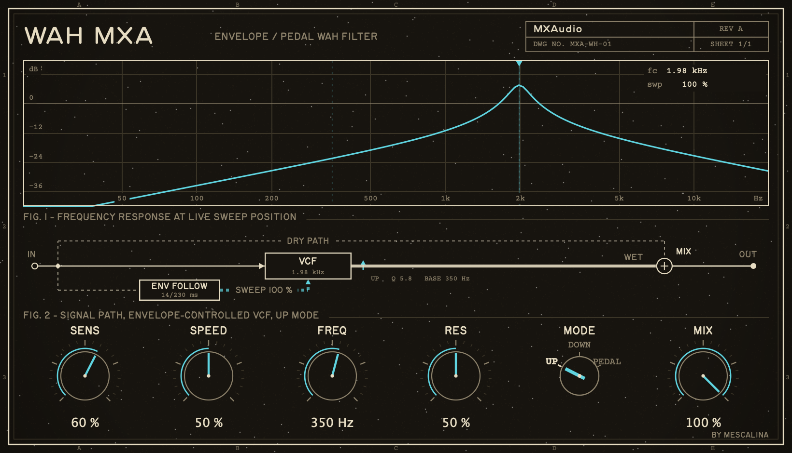

# WahMXA

An auto-wah with three drive modes: an envelope follower (up or down) or an automatic pedal LFO sweeps a resonant TPT state-variable band-pass over 2.5 octaves.



Audio plugin (AU / VST3 / Standalone) built with [JUCE](https://juce.com). Part of the [MXA plugin suite](https://mxaudio.mescalina.fr/). macOS 11+ and Windows — Windows builds (VST3 + Standalone) are available in [Releases](https://github.com/uprod/WahMXA/releases).

## Build

```sh
git clone --recurse-submodules https://github.com/uprod/WahMXA.git
cd WahMXA
cmake -B build -DCMAKE_BUILD_TYPE=Release
cmake --build build
```

If you already have the MXA suite checked out with a shared `../JUCE` folder, the submodule is optional — the build falls back to the sibling folder automatically.
